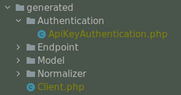

# Component: OpenAPI

Jane OpenAPI is a library to generate, in PHP, an HTTP client and its associated models and serializers from a
[OpenAPI](https://www.openapis.org/) specification: version 2.0, 3.0.x or 3.1.x. Jane supports OpenAPI v2, v3.0 and v3.1. Depending on
your OpenAPI version, the command line will detect which version to use and if this version is installed in
your dependencies.

## At a glance

- OpenAPI code generation supports 2.0, 3.0.x and 3.1.x.
- Generated client/runtime remains the same usage pattern across versions.
- Validation follows the JSON Schema validation rules (see [Validation guide](../guides/validation.md)).

## Supported versions

- OpenAPI 2.0
- OpenAPI 3.0.x
- OpenAPI 3.1.x

## Installation

Jane supports OpenAPI v2, v3.0 and v3.1. Depending on your OpenAPI version, the command line will detect which version to use
and if this version is installed in your dependencies.

You have to add the generation library as a `dev` dependency. This library contains a lot of dependencies, to be able
to generate code, which are not needed on runtime. However, the generated code depends on other libraries and a few
classes that are available through the runtime package. It is mandatory to add the runtime dependency as a requirement.
Choose your library depending on OpenAPI version you need (you can even install both if you want):

```bash
# OpenAPI 2
composer require --dev jane-php/open-api-2
composer require jane-php/open-api-runtime

# OpenAPI 3.0.x
composer require --dev jane-php/open-api-3
composer require jane-php/open-api-runtime

# OpenAPI 3.1.x
composer require --dev jane-php/open-api-3-1
composer require jane-php/open-api-runtime
```

Check [Compatibility](guides/compatibility.md) for version support details.

With Symfony ecosystem, we created a recipe to make it easier to use Jane. You just have to allow contrib recipes before
installing our packages:

```bash
composer config extra.symfony.allow-contrib true
```

Then when installing `jane-php/open-api-*`, it will add all the required files:

- `bin/jane-open-api-generate`: a binary file to run JSON Schema generation based on `config/jane/open-api.php`
  configuration;
- `config/jane/open-api.php`: your Jane configuration (see "Configuration file");
- `config/packages/open-api.yaml`: Symfony Serializer configured to be optimized for Jane.

By default, generated code is not formatted, to make it compliant to PSR2 standard and others coding style formats, you
can add the [PHP CS Fixer](http://cs.sensiolabs.org/) library to your dev dependencies (and it makes it easier to
debug!):

```bash
composer require --dev friendsofphp/php-cs-fixer
```

## Generating a Client

This library provides a PHP console application to generate the Model. You can use it by executing the following command
at the root of your project:

```bash
php vendor/bin/jane-openapi generate
```

This command will try to read a config file named `.jane-openapi` located on the current working directory. However,
you can name it as you like and use the `--config-file` option to specify its location and name:

```bash
php vendor/bin/jane-openapi generate --config-file=jane-openapi-configuration.php
```

> [!NOTE]
> If you are using Symfony recipe, this command is embbeded in the `bin/jane-open-api-generate` binary file, you only
> have to run it to make it work 🎉

> [!NOTE]
> No others options can be passed to the command. Having a config file ensure that a team working on the project
> always use the same set of parameters and, when it changes, give vision of the new option(s) used to generate the
> code.

> [!TIP]
> If you have a really big specification and want to optimize your generation time, you can disable garbage collector
> during generation, you can read more about it on
> [Scrutinizer blog post](https://scrutinizer-ci.com/blog/composer-gc-performance-who-is-affected-too). To do that,
> use Jane as following: `php -d zend.enable_gc=0 vendor/bin/jane-openapi generate`.

### Configuration file

The configuration file consists of a simple PHP script returning an array:

```php
return [
  'openapi-file' => __DIR__ . '/open-api.json',
  'namespace' => 'Vendor\Library\Generated',
  'directory' => __DIR__ . '/generated',
];
```

This example shows the minimum configuration required to generate a client:

* `openapi-file`: Specify the location of your OpenApi file, it can be a local file or a remote one
 `https://my.domain.com/my-api.json`. It can also be a `yaml` file.
* `namespace`: Root namespace of all of your generated code
* `directory`: Directory where the code will be generated

Given this configuration, you will need to add the following configuration to composer, in order to load the generated
files:

```json
"autoload": {
  "psr-4": {
    "Vendor\\Library\\Generated\\": "generated/"
  }
}
```

### Options

Other options are available to customize the generated code:

- `reference`: A boolean which indicate to add the support for
[JSON Reference](https://tools.ietf.org/id/draft-pbryan-zyp-json-ref-03.html) into the generated code.
- `date-format`: A date-time format to specify how the generated code should encode and decode `\DateTime` object
 to string.  This option is only for format `date-time`.
- `full-date-format`: A date format to specify how the generated code should encode and decode `\DateTime` object
 to string. This option is only for format `date`.
- `date-prefer-interface`: The `\DateTimeInterface` is the base of every `\DateTime` related action. This makes
 it more compatible with other DateTime libraries like [Carbon](https://carbon.nesbot.com/). This option replace
 `\DateTime` returns with `\DateTimeInterface`, it's disabled by default.
- `date-input-format`: During denormalization (from array to object), we may have a different format than the output
 format. This option allows you to specify which format you want. By default it will take `date-format`
 configuration.
- `strict`: A boolean which indicate strict mode (true by default), not strict mode generate more permissive client
 not respecting some standards (nullable field as an example) client.
- `use-fixer`: A boolean which indicate if we make a first cs-fix after code generation, is disabled by default.
- `fixer-config-file`: A string to specify where to find the custom configuration for the cs-fixer after code
 generation, will remove all Jane default cs-fixer default configuration.
- `clean-generated`: A boolean which indicate if we clean generated output before generating new files, is enabled by
 default.
- `use-cacheable-supports-method`: A boolean which indicate if we use `CacheableSupportsMethodInterface` interface
 to improve caching performances when used with Symfony Serializer.
- `skip-null-values`: When having nullable properties, you can enforce normalization to skip theses
 properties even if they are nullable. This option allows you to not have theses properties when they're not set
 (`null`). By default it is enabled.
- `skip-required-fields`: If your model has required fields, this option allows you to skip the required behavior
 that forces them to be present during denormalization. By default it is disabled
- `validation`: Will enable validation following JSON Schema validation specification. By default it is disabled. You
  can read more about it on the dedicated guide: [Validation guide](../guides/validation.md).
- `validators`: An array of `Jane\Component\JsonSchema\Guesser\Validator\ValidatorInterface` instances to register
  additional validators during generation. Only meaningful when `validation` is enabled. See the
  [Custom validators](../guides/validation.md#custom-validators) section of the Validation guide.
- `include-null-value`: Will enable a way to manage null values. By default it is enabled.
- `enums-as-objects`: When enabled, schemas with `type: string` or `type: integer` and an `enum` will be generated as native PHP backed enums instead of plain scalar types, and properties referencing these schemas will be typed with the enum class. Disabled by default.
- `default-additional-properties`: Controls how a schema that leaves `additionalProperties` unspecified is treated.
  `null` (default) keeps each component's own behavior: closed models for OpenAPI 2, open models (unknown keys
  captured) for OpenAPI 3 / 3.1. `true` treats unspecified `additionalProperties` as open in every component;
  `false` treats it as closed in every component — the recommended setting when migrating from older Jane versions
  where unspecified meant closed. An explicit `additionalProperties` value in the specification always wins over
  this option. The generated Symfony validation `Collection` constraint (`allowExtraFields`) follows the same
  resolution: while the option is unset it keeps its previous behavior (extra fields allowed), and once the option is
  set — or the specification sets `additionalProperties: false` — it matches the generated model.
- `allow-external-refs`: A boolean which indicates whether remote (`http://` / `https://`) references may be resolved
  during code generation. Disabled by default: Jane rejects external references to protect you from SSRF and
  unwanted network access at generation time. Enable it only if your specification legitimately references remote
  documents.
- `external-ref-allowed-hosts`: An array of host names restricting which remote hosts `allow-external-refs` may reach
  (subdomains of the listed hosts are allowed too). When empty, every host is allowed as long as
  `allow-external-refs` is enabled.
- `external-ref-follow-redirects`: A boolean controlling whether fetching a remote reference may follow HTTP
  redirects. Disabled by default: a redirect response aborts the resolution, so an allowlisted host cannot bounce
  the fetch to an arbitrary host. When enabled, redirects are followed blindly — the redirect target host is not
  re-checked against `external-ref-allowed-hosts`, so only enable this for specifications whose remote documents
  you fully trust.
- `allowed-local-ref-roots`: An array of directory roots a local reference may resolve into, in addition to the
  directory of the referencing document (which is always allowed). By default a local `$ref` can only point to a
  file inside its own directory, so split layouts like this one fail to generate:

  ```
  doc/
  ├── api/
  │   └── openapi.yaml      <- $ref: '../schema/institution.yaml#/Institution'
  └── schema/
      └── institution.yaml
  ```

  Declaring a common parent directory as an allowed root unlocks it:

```php
return [
  // your usual configuration ...
  'allowed-local-ref-roots' => [
    __DIR__ . '/doc',
  ],
];
```

  Roots are normalized with `realpath()`: if your layout involves symlinks, declare the real target path.
- `whitelisted-paths`: This option allows you to generate only needed endpoints and related models. Be carefull,
  that option will filter models used by whitelisted endpoints and generate model & normalizer only for them.
  Models that are not reachable from any whitelisted endpoint are skipped entirely: an invalid schema referenced
  only by non-whitelisted endpoints will not make the generation fail (errors in models used by whitelisted
  endpoints are still reported). Here is
  some examples about how to use it:

```php
return [
  // your usual configuration ...
  'whitelisted-paths' => [
    '\/foo$',
    ['\/foo\/(bar|baz)'],
    ['\/foo$', 'GET'],
    ['\/foo$', ['POST']],
    ['\/foo$', ['POST', 'PUT']]
  ],
];
```
There is many ways to use it, first you atleast need a regex defining which endpoint is whitelisted. This endpoint
can be either a string or in an array. If you don't provide any HTTP method, we will just accept any methods, but
you can provide either a string or array as second argument to specify which method you accept.
- `endpoint-generator`: Generator which can specify custom endpoint interface & corresponding trait. It accepts either
 a class name (this class should extend `\Jane\Component\OpenApi3\Generator\EndpointGenerator`) or a ready-made
 instance implementing `\Jane\Component\OpenApiCommon\Generator\EndpointGeneratorInterface`, so you can build it
 yourself with the dependencies of your choice
- `operation-namings`: An array of `\Jane\Component\OpenApiCommon\Naming\OperationNamingInterface` instances used to
  generate client method names and endpoint classes. Instances are consulted in order and must return `''` to defer to
  the next one. Defaults to `operationId`-based naming with URL-based fallback. See the
  [Custom operation naming](#custom-operation-naming) section for more details.
- `custom-query-resolver`: This option allows you to customize the query parameter normalizer for each of the API
 endpoint with a userland callback. Here is all possible combinations::
```php
use App\BoolCustomQueryResolver;
use App\IntCustomQueryResolver;
use App\BarCustomQueryResolver;
use App\BazCustomQueryResolver;

return [
  // your usual configuration ...
  'custom-query-resolver' => [
    '__type' => [
      'bool' => BoolCustomQueryResolver::class,
      'int' => IntCustomQueryResolver::class,
    ],
    '/foo' => [
      'get' => [
        'bar' => BarCustomQueryResolver::class,
        'baz' => BazCustomQueryResolver::class,
      ],
      'post' => [
        'bar' => BarCustomQueryResolver::class,
      ],
    ],
  ],
];
```
There are many ways to use it. You can either use the `__type` key to specify a custom query normalizer for a
 given type (`bool`, `int`, `string`, ...) and give it your class that contains the custom normalizer by
 extending the generated runtime `CustomQueryResolver` class. You can also filter the usage of your custom
 normalizer by giving the exact path, method and parameter name where you want to apply it.
- `generate-error-exceptions`: Will generate a dedicated exception class for every declared error response (status >= 400)
 and throw it with the deserialized typed error model. When disabled, declared error responses are denormalized into
 their typed model and returned like any other response. Undeclared statuses remain governed by
 `throw-unexpected-status-code`. By default, it's enabled.
- `throw-unexpected-status-code`: Will throw a `BadResponseException` if nothing has been matched during
 the transformation of the Endpoint body (including described exceptions). This exception extends
 `UnexpectedStatusCodeException` and exposes the original PSR-7 response through its `getResponse()` method.
 By default, it's disabled.
- `custom-string-format-mapping`: This option allows you to specify in which class a string property will be
 deserialized according to it's format option. It can be used to customize a date-time field, or to add non supported
formats. More details in the dedicated section.

## Query parameter serialization (OpenAPI 3.x)

For `query` parameters, Jane reads the OpenAPI [`style`](https://spec.openapis.org/oas/v3.0.3#style-values) and
`explode` fields and generates a `getQueryStyles()` method in each affected Endpoint class. The runtime then
serializes values accordingly:

| Style | `explode: true` | `explode: false` |
|-------|-----------------|------------------|
| `form` (default) | objects: each property becomes a top level pair (`?name=john&country=SE`); arrays repeat the parameter name (`?param=a&param=b`) | values joined with `,` (`?color=blue,black`; objects interleave keys and values: `?color=R,100,G,200`) |
| `spaceDelimited` | like `form` exploded | values joined with a space (`?color=blue%20black`) |
| `pipeDelimited` | like `form` exploded | values joined with `\|` (`?color=blue\|black`) |
| `deepObject` | bracket notation at every level (`?filter[from]=a&filter[range][to]=b`) | not applicable |

When neither `style` nor `explode` is set, OpenAPI defaults apply (`form` for query parameters, `explode: true`
when style is `form`). These defaults are only materialized for parameters whose schema is an `object` or an
`array`: scalar parameters keep their historical encoding.

Additional rules:

- Nesting beyond the first level uses PHP bracket notation with explicit indices, e.g.
  `?search[address][city]=NY` or `?tags[0]=a&tags[1]=b`. The OpenAPI specification does not define deeper
  nesting, so this is Jane's convention.
- `spaceDelimited`, `pipeDelimited` and non-exploded `form` only support flat values; providing nested
  arrays/objects throws an `\InvalidArgumentException` when building the query string.
- Parameters declaring a `content` field are serialized from their content and ignore `style` / `explode`,
  as specified by OpenAPI.

## Namespacing generated code with `x-namespace`

By default, Jane generates every Endpoint in `Endpoint\`, every Model in `Model\`, ... With the OpenAPI
[Specification Extensions](https://spec.openapis.org/oas/v3.1.0#specification-extensions) mechanism, you can opt-in
to a sub-namespace per artifact by declaring an `x-namespace` attribute:

- on an **operation**: its Endpoint class (and the Models generated for its inline request bodies / responses, see
  below) moves to `Endpoint\<x-namespace>\`
- on a **schema** (`components.schemas` entry in OpenAPI 3.x, `definitions` entry in OpenAPI 2): its Model,
  Normalizer and Validator classes move to `Model\<x-namespace>\`, `Normalizer\<x-namespace>\`, ...

```yaml
paths:
  /users:
    get:
      operationId: getUsers
      x-namespace: Admin\Reports
      responses:
        '200':
          description: OK
          content:
            application/json:
              schema:
                $ref: '#/components/schemas/User'
components:
  schemas:
    User:
      x-namespace: Directory
      type: object
```

With this specification:

- `Endpoint\Admin\Reports\GetUsers` is generated instead of `Endpoint\GetUsers`
- `Model\Directory\User` (+ its normalizer / validator) is generated instead of `Model\User`

Rules:

- The value may contain several segments separated by `\` or `/`, e.g. `"Admin\Reports"` or `"Directory/Users"`.
  Each segment is sanitized like class names (invalid characters removed, reserved words prefixed with `_`,
  e.g. `"list"` becomes `_List`).
- Artifacts without the attribute keep the flat layout: adding `x-namespace` only affects annotated artifacts.
- Inline request body / response models of a namespaced operation inherit the operation's namespace, so they stay
  next to their endpoint. A schema referenced by that operation which declares its own `x-namespace` always wins:
  explicit attributes are never overridden.
- Renaming or removing an `x-namespace` attribute after generation changes the FQCNs of the affected classes and is
  therefore a BC break for consumers of your generated library.

## Using a generated client

Generating a client will produce same classes as the [JSON Schema](../json_schema/component.md) library:

- Model files in the `Model` namespace
- Normalizer files in the `Normalizer` namespace
- A `JaneObjectNormalizer` class in the `Normalizer` namespace

Furthermore, it generates:

- Endpoints files in the `Endpoint` namespace, each API Endpoint will generate a class containing all the logic to
 go from Object to Request, and from Response to Object with the generated Normalizer
- `Client` file in the root namespace containing all API endpoints

## Creating the API Client

Generated `Client` class have a static method `create` which act like a factory to create your Client:

```php
$apiClient = Vendor\Library\Generated\Client::create();
```

> [!NOTE]
> If you are using Symfony recipe, the client will be autowired. So you can use it anywhere by using your Client class

> [!NOTE]
> Optionally, you can pass a custom ``HttpClient`` respecting the [PSR18](https://www.php-fig.org/psr/psr-18/) Client
> standard. If you which to use the constructor to reuse existing instances, sections below describe the 4 services
> used by it and how to create them.

### Creating the Http Client

The main dependency on the `Client` class is an HTTP client respecting the [PSR18](https://www.php-fig.org/psr/psr-18/)
client standard. We highly recommend you to read the [PSR18](https://www.php-fig.org/psr/psr-18/) specification. This
HTTP client MAY redirect on a 3XX responses (depend on your API), but it MUST not throw errors on 4XX and 5XX responses,
as this can be handle by the generated code directly.

Recommended way of creating an HTTP Client is by using the [discovery](http://docs.php-http.org/en/latest/discovery.html)
 library to create the client::

```php
$httpClient = Http\Discovery\Psr18ClientDiscovery::find();
```

This allows user of the API to use any client respecting the standard.

> [!TIP]
> You can use clients such as Symfony [HttpClient](https://symfony.com/doc/current/components/http_client.html#psr-18)
> as [PSR18](https://www.php-fig.org/psr/psr-18/) client.

### Creating the Request Factory

The generated endpoints will also need a factory to transform parameters and object of the endpoint to a
[PSR7 Request](http://www.php-fig.org/psr/psr-7/#32-psrhttpmessagerequestinterface).

Like the HTTP Client, it is recommended to use the [discovery](http://docs.php-http.org/en/latest/discovery.html)
library to create it:

```php
$requestFactory = Http\Discovery\Psr17FactoryDiscovery::findRequestFactory();
```

### Creating the Serializer

Like in [JSON Schema component](../json_schema/component.md), creating a serializer is done by using the
`JaneObjectNormalizer` class:

```php
$normalizers = [
  new \Symfony\Component\Serializer\Normalizer\ArrayDenormalizer(),
  new \Vendor\Library\Generated\Normalizer\JaneObjectNormalizer(),
];

$serializer = new \Symfony\Component\Serializer\Serializer($normalizers, [new \Symfony\Component\Serializer\Encoder\JsonEncoder()]);
$serializer->deserialize('{...}');
```

With Symfony ecosystem, you just have to use the recipe and all the configuration will be added automatically.
This serializer will be able to encode and decode every data respecting your OpenAPI specification thanks to autowiring
of the generated normalizers.

### Creating the Stream Factory

The generated endpoints will also need a service to transform body parameters like `resource` or `string` into
[PSR7 Stream](https://www.php-fig.org/psr/psr-7/#34-psrhttpmessagestreaminterface) when uploading file (multipart form).

Like the HTTP Client and Request Factory, it is recommended to use the
[discovery](http://docs.php-http.org/en/latest/discovery.html) library to create it:

```php
$streamFactory = Http\Discovery\Psr17FactoryDiscovery::findStreamFactory();
```

## Using the API Client

Generated code has complete [PHPDoc](https://www.phpdoc.org/) comment on each method, which should correctly describe
the endpoint. Method names for each endpoint depends on the `operationId` property of the OpenAPI specification. And if
not present it will be generated from the endpoint path:

```php
$apiClient = Vendor\Library\Generated\Client::create();
// Operation id being listFoo
$foos = $apiClient->listFoo();
```

Also depending on the parameters of the endpoint, it may have 2 to more arguments.

Last parameter of each endpoint, allows to specify which type of data the method must return. By default, it will try to
return an object depending on the status code of your response. But you can force the method to return a
[PSR7 Response](http://www.php-fig.org/psr/psr-7/#33-psrhttpmessageresponseinterface) object:

```php
$apiClient = Vendor\Library\Generated\Client::create();
// First argument is an empty list of parameters, second one being the return type
$response = $apiClient->listFoo([], Vendor\Library\Generated\Client::FETCH_RESPONSE);
```

This allow to do custom work when the API does not return standard JSON body.

### Host and basePath support

Jane OpenAPI will never generate the complete url with the host and the base path for an endpoint. Instead, it will only
do a request on the specified path.

If host and/or base path is present in the specification it is added, via the `PluginClient`, `AddHostPlugin` and
`AddPathPlugin` thanks to `php-http plugin system`_ when using the static `create`.

This allow you to configure different host and base path given a specific environment / server, which may defer when in test,
preprod and production environment.

Jane OpenAPI will always try to use `https` if present in the scheme (or if there is no scheme). It will use the first scheme
present if `https` is not present.

Those plugins are also applied when you provide your own PSR-18 client to the static `create` method. If you do not want
the host and/or base path of the specification to be applied around your client (for example because it is already fully
configured with the correct base URL, or you manage the URL yourself through your own plugins), pass `false` as fourth
argument:

```php
$apiClient = Vendor\Library\Generated\Client::create($myPsr18Client, [], [], false);
```

The parameter only exists on generated clients whose specification declares a server URL (OpenAPI 3 `servers`, OpenAPI 2
`host` / `basePath`).

### Having custom plugins

If you want to support more behavior such as authentication or other stuff that need a plugin, you can pass them
through the second argument of the static `create` method.

### Authentication

We do generate a plugin for each authentication method declared in your scheme. It does support:

- `apiKey` in header & query for both OpenAPI v2 and v3.x
- HTTP Basic & Bearer for OpenAPI v3.x

Quick example of how your authentication definition could look (OpenAPI v3):

```yaml
components:
  securitySchemes:
    BasicAuth:
      type: http
      scheme: basic
    BearerAuth:
      type: http
      scheme: bearer
    ApiKeyAuth:
      type: apiKey
      in: header
      name: X-API-Key
```

When your OpenAPI definition contains it, Jane will generate a Authentication namespace that contains all plugins you
need for your API.
Then you give all your authentication plugins to `Jane\Component\OpenApiRuntime\Client\Plugin\AuthenticationRegistry`.
And finally you can pass it to your Jane Client (only if you let Jane make a HTTP Client for you, otherwise this second
parameters is ignored).

An example Authentification directory:



This `AuthenticationRegistry` class is used to match security scopes in your API, if an Endpoint require a certain
authentication method, then it will use it. You need to have `security` fields correctly made in your scheme in order
to use this class. If they're not set, you can simply pass the authentication plugin to your Jane Client.

Here is how you can use it:

```php
$authenticationRegistry = new AuthenticationRegistry([new ApiKeyAuthentication($this->apiKey)]);
$client = Client::create(null, [$authenticationRegistry]);
$foo = $client->foo();
```

You can replace `Client::create` first argument with your custom HttpClient if needed as usual.

## Custom operation naming

Client method names and endpoint class names are generated by implementations of
`\Jane\Component\OpenApiCommon\Naming\OperationNamingInterface`. By default, Jane uses the operation `operationId`
when available and falls back to URL-based naming. You can provide your own naming strategies with the
`operation-namings` option:

```php
return [
  // your usual configuration ...
  'operation-namings' => [
    new \App\Jane\PrefixedOperationNaming('api'),
  ],
];
```

A single instance can also be provided directly instead of an array. Instances are consulted in order: when one
returns `''`, the next naming of the chain is used. If every naming returns `''`, generation fails, so you generally
want to end your chain with the built-in namings (`\Jane\Component\OpenApiCommon\Naming\OperationIdNaming`,
`\Jane\Component\OpenApiCommon\Naming\OperationUrlNaming`) which provide the default behavior as fallback.

Here is an example implementation prefixing every non-GET operation:

```php
namespace App\Jane;

use Jane\Component\JsonSchema\Generator\Naming;
use Jane\Component\OpenApiCommon\Guesser\Guess\OperationGuess;
use Jane\Component\OpenApiCommon\Naming\OperationNamingInterface;

class PrefixedOperationNaming implements OperationNamingInterface
{
  public function __construct(
    private readonly string $prefix,
    private readonly Naming $naming = new Naming(),
  ) {
  }

  public function getFunctionName(OperationGuess $operation): string
  {
    if ('GET' === $operation->getMethod()) {
      return ''; // defer GET operations to the next naming of the chain
    }

    return lcfirst(str_replace(' ', '', ucwords($this->prefix . ' ' . str_replace('/', ' ', $operation->getPath()))));
  }

  public function getEndpointName(OperationGuess $operation): string
  {
    if ('GET' === $operation->getMethod()) {
      return '';
    }

    $className = str_replace(' ', '', ucwords($this->prefix . ' ' . str_replace('/', ' ', $operation->getPath())));

    // make sure we do not generate a class named after a PHP reserved word
    return $this->naming->fixReservedClassName($className);
  }
}
```

When writing your own naming strategy, keep the following contract in mind:

- be deterministic and pure: called twice with the same operation, a naming must return identical results;
- be stateless: a naming instance may be reused for every operation of a specification (and even for several
  specifications);
- return valid PHP identifiers for method and class names, and try to keep them unique across the generated client
  (Jane additionally deduplicates colliding names with an incrementing suffix, but relying on it makes names depend
  on operation order);
- namings are OpenAPI version agnostic: when you need version specific data, detect the version through `instanceof`
  checks on `$operation->getOperation()`.

> [!WARNING]
> Providing this option replaces the whole default naming chain: built-in fallbacks and guards (such as the
> `operationId` fallback or PHP reserved word handling) only apply if you add the corresponding built-in namings at
> the end of your chain.

## Extending the Client

Some endpoints need sometimes custom implementation that were not possible to generate through the OpenAPI
specification. Jane OpenAPI try to be nice with this and each specific behavior of an API call has been seprated into
different methods which are public or protected.

As an exemple you may want to encode in base64 a specific query parameter of an Endpoint. First step is to create your
own Endpoint extending the generated one:

```php
namespace Vendor\Library\Generated\Endpoint;

use Vendor\Library\Generated\Endpoint\FooEndpoint as BaseEndpoint;
use Symfony\Component\OptionsResolver\Options;
use Symfony\Component\OptionsResolver\OptionsResolver;

class FooEndpoint extends BaseEndpoint
{
  protected function getQueryOptionsResolver(): OptionsResolver
  {
    $optionsResolver = parent::getQueryOptionsResolver();
    $optionsResolver->setNormalizer('bar', function (Options $options, $value) {
      return base64_encode($value);
    });

    return $optionsResolver;
  }
}
```

Once this endpoint is generated, you need to tell your Client to use yours endpoint instead of the Generated one. For
that you can extends the generated client and override the method that use this endpoint:

```php
namespace Vendor\Library\Generated;

use Vendor\Library\Generated\Client as BaseClient;
use Vendor\Library\Generated\Endpoint\FooEndpoint;

class Client extends BaseClient
{
  public function getFoo(array $queryParameters = [], $fetch = self::FETCH_OBJECT)
  {
    return $this->executePsr7Endpoint(new FooEndpoint($queryParameters), $fetch);
  }
}
```

Then you will need to use your own client instead of the generated one. To extends other parts of the endpoint you can
look at the generated code.

## Custom string formats

Jane support some strings format, but it can't support all of them because it's an open keyword.
You may want to serialize a property to an UUID, or have a specific datetime format for a field (a datetime format that
is not the same as the one configured with `date-format` or `full-date-format`.

To do so, you need to provide:

- while generating the client: an associative array for the key `custom-string-format-mapping`
- at runtime: one or more Normalizer (which implement `Symfony\Component\Serializer\Normalizer\NormalizerInterface`)


### Example

Configuration file:

```php
return [
  'json-schema-file' => __DIR__ . '/json-schema.json',
  'root-class' => 'MyModel',
  'namespace' => 'Vendor\Library\Generated',
  'directory' => __DIR__ . '/generated',
  'custom-string-format-mapping' => [
    'uuid' => \Symfony\Component\Uid\UuidV4::class
  ]
];
```

Your OpenAPI schema:

```yaml
openapi: "3.0.0"
info:
  version: 1.0.0
  title: Example
paths:
  /some-path:
   get:
     summary: Get something
     operationId: getSomething
     responses:
       '200':
          description: Expected response to a valid request
          content:
            application/json:
              schema:
                $ref: "#/components/schemas/Something"
components:
  schemas:
    Something:
      type: object
      required:
        - id
        - uuid
      properties:
        id:
          type: 'integer'
        uuid:
          type: 'string'
          # the following keyword is important
          format: 'uuid'
```

Usage of the generated client:

```php
$client = \Vendor\Library\Generated\Client::create(
  $httpClient,
  [], // additional http client plugins
  // additional normalizers
  [
    new \Symfony\Component\Serializer\Normalizer\UidNormalizer()
  ]
);
```
