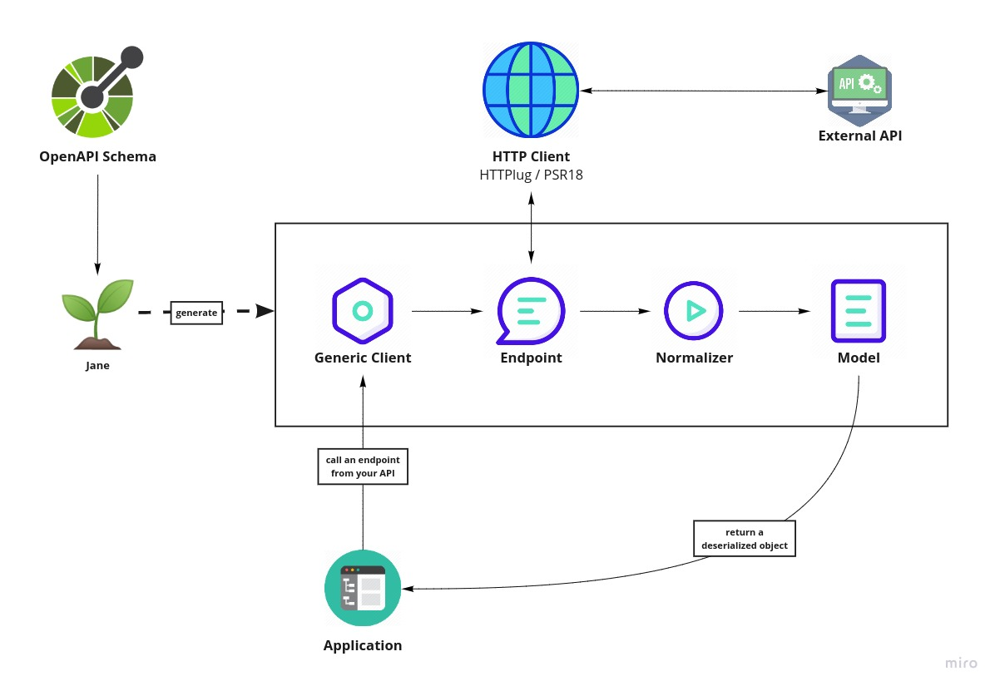

# Getting started: using OpenAPI

Jane OpenAPI is a library to generate, in PHP, an http client and its associated models and serializers from a
[OpenAPI](https://www.openapis.org/) specification: version 2.0, 3.0.x or 3.1.x.

## At a glance

- Generate a client based on [Symfony HttpClient](https://symfony.com/doc/current/components/http_client.html) (endpoint classes, models and normalizers included).
- Works with OpenAPI 2.0, 3.0.x and 3.1.x.
- Use [OpenAPI component](./component.md) for full options and advanced configuration.

## Supported versions

- OpenAPI 2.0
- OpenAPI 3.0.x
- OpenAPI 3.1.x

## Jump to

- [Installation](#installation)
- [Generating](#generating)
- [Configuration file](#configuration-file)
- [Using](#using)

Here is a quick schema to understand what Jane does and how does it work with your APIs



From left to right, Jane is gonna take your OpenAPI specification and generate files

- Generic client will be your starting point for your API, it will contains a `create` method to initialize everything
we need and will have methods for all your API endpoints;
- Endpoint will be generated corresponding to all GET / POST / PUT / ... endpoints your declared, they will be called
in the Client instance methods;
- Normalizer will allow to convert from array to object and reverse, based on your models specification;
- Model are you model specification as PHP classes.

## Installation

Jane supports OpenAPI v2, v3.0 and v3.1. Depending on your OpenAPI version, the command line will detect which version to use
and if this version is installed in your dependencies.

You have to add the generation library as a `dev` dependency. This library contains a lot of dependencies, to be able
to generate code, which are not needed on runtime. However, the generated code depends on other libraries and a few
classes that are available through the runtime package. It is highly recommended to add the runtime dependency as a
requirement. Choose your library depending on OpenAPI version you need (you can even install both if you want):

```bash
# OpenAPI 2
composer require --dev jane-php/open-api-2
composer require jane-php/open-api-runtime

# OpenAPI 3.0.x
composer require --dev jane-php/open-api-3
composer require jane-php/open-api-runtime

# OpenAPI 3.1.x
composer require --dev jane-php/open-api-3-1
composer require jane-php/open-api-runtime
```

With Symfony ecosystem, we created a recipe to make it easier to use Jane. You just have to allow contrib recipes before
installing our packages:

```bash
composer config extra.symfony.allow-contrib true
```

Then when installing `jane-php/open-api-*`, it will add all required files:

- `bin/jane-open-api-generate`: a binary file to run JSON Schema generation based on `config/jane/open-api.php`
configuration.
- `config/jane/open-api.php`: your Jane configuration (see "Configuration file")
- `config/packages/open-api.yaml`: Symfony Serializer configured to be optimized for Jane

By default, generated code is not formatted. To make it compliant to PSR2 standard and others format norms, you can add
the [PHP CS Fixer](http://cs.sensiolabs.org/) library to your dev dependencies (and it makes it easier to debug!):

```bash
composer require --dev friendsofphp/php-cs-fixer
```

## Generating

This library provides a PHP console application to generate the Model. You can use it by executing the following command
at the root of your project:

```bash
php vendor/bin/jane-openapi generate
```

This command will try to read a config file named `.jane-openapi` located on the current working directory. However,
you can name it as you like and use the `--config-file` option to specify its location and name:

```bash
php vendor/bin/jane-openapi generate --config-file=jane-openapi-configuration.php
```

> [!NOTE]
> If you are using Symfony recipe, this command is embbeded in the `bin/jane-open-api-generate` binary file, you only
> have to run it to make it work 🎉

> [!NOTE]
> No others options can be passed to the command. Having a config file ensure that a team working on the project
> always use the same set of parameters and, when it changes, give vision of the new option(s) used to generate the
> code.

## Configuration file

The configuration file consists of a simple PHP script returning an array:

```php
return [
  'openapi-file' => __DIR__ . '/open-api.json',
  'namespace' => 'Vendor\Library\Generated',
  'directory' => __DIR__ . '/generated',
];
```

This example shows the minimum configuration required to generate a client:

* `openapi-file`: Specify the location of your OpenApi file, it can be a local file or a remote one
  `https://my.domain.com/my-api.json`. It can also be a `yaml` file.
* `namespace`: Root namespace of all of your generated code
* `directory`: Directory where the code will be generated

Given this configuration, you will need to add the following configuration to composer, in order to load the generated
files:

```json
"autoload": {
  "psr-4": {
    "Vendor\\Library\\Generated\\": "generated/"
  }
}
```

For more details about OpenAPI generation, you can read the [OpenAPI component](./component.md) documentation.

## Using

Generating a client will produce same classes as the [JSON Schema](./../json_schema/getting_started.md) library:

* Model files in the `Model` namespace
* Normalizer files in the `Normalizer` namespace
* A `JaneObjectNormalizer` class in the `Normalizer` namespace

Furthermore, it generates:

* Endpoints files in the `Endpoint` namespace, each API Endpoint will generate a class containing all the logic to
go from Object to Request, and from Response to Object with the generated Normalizer
* `Client` file in the root namespace containing all API endpoints

## Creating the API Client

Generated `Client` class have a static method `create` which act like a factory to create your Client:

```php
$apiClient = Vendor\Library\Generated\Client::create();
```

> [!NOTE]
> If you are using Symfony recipe, the client will be autowired. So you can use it anywhere by using your Client class

## Creating the Serializer

Like in the [JSON Schema library](./../json_schema/getting_started.md), creating a serializer is done by using the `JaneObjectNormalizer` class:

```php
$normalizers = [
  new \Symfony\Component\Serializer\Normalizer\ArrayDenormalizer(),
  new \Vendor\Library\Generated\Normalizer\JaneObjectNormalizer(),
];

$serializer = new \Symfony\Component\Serializer\Serializer($normalizers, [new \Symfony\Component\Serializer\Encoder\JsonEncoder()]);
$serializer->deserialize('{...}');
```

With Symfony ecosystem, you just have to use the recipe and all the configuration will be added automatically.
This serializer will be able to encode and decode every data respecting your OpenAPI specification thanks to autowiring
of the generated normalizers.

## Using the API Client

Generated code has complete [PHPDoc](https://www.phpdoc.org/) comment on each method, which should correctly describe the endpoint.
Method names for each endpoint depends on the `operationId` property of the OpenAPI specification. And if not present
it will be generated from the endpoint path:

```php
$apiClient = Vendor\Library\Generated\Client::create();
// Operation id being listFoo
$foos = $apiClient->listFoo();
```

Also depending on the parameters of the endpoint, it may have 2 or more arguments.
Method names can be fully customized with the `operation-namings` option, see the
[Custom operation naming](./component.md#custom-operation-naming) section.
For more details about using OpenAPI, you can read [OpenAPI component](./component.md) documentation.

## Related

- [OpenAPI component](./component.md)
- [Nullability guide](../guides/nullable.md)
- [Compatibility guide](../guides/compatibility.md)
- [Project changelog](https://github.com/janephp/janephp/blob/main/CHANGELOG.md)
